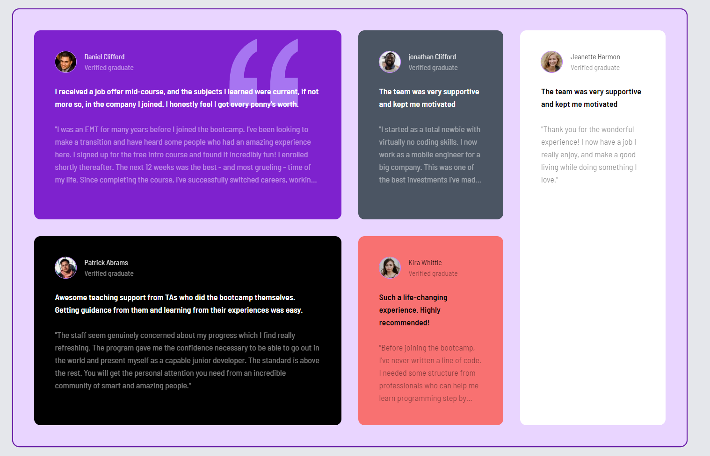

# Tailwind Grid System Documentation

## Live Demo

- [Screenshots](#screenshots)
- [Features](#features)

## Screenshots

- Large Screens
  

- Medium Screens
  

- Small Screens
  

## Features

**Key Features:**

- **Responsive Design:** Easily create responsive layouts for various screen sizes.
- **Tailwind Integration:** Leverage the popular Tailwind CSS framework for styling.
- **Grid System:** Implement a flexible grid system for efficient organization of content.

**Happy tailwind!**
